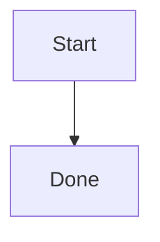

# mdml

**mdml** converts Markdown files to themed HTML on your machine. There is no server, account, or upload step.

```bash
mdml README.md
mdml README.md --theme github
mdml README.md --theme ./company.html
```

`README.md` becomes `README.html` next to the source file.

## Features

- CommonMark / GitHub Flavored Markdown (tables, task lists, strikethrough, fenced code)
- Built-in themes (`default`, `github`) plus custom HTML theme files
- User theme directory (no plugins)
- Mermaid diagrams in ` ```mermaid ` fences, rendered in the browser
- CLI designed for scripts and CI
- Optional Finder / Explorer “Convert to HTML” after installing a package

## Requirements

- To **run a packaged build**: nothing else. The macOS `.pkg` and Windows zip are self-contained.
- To **build from source**: [.NET 10 SDK](https://dotnet.microsoft.com/download)

## Install

### macOS

Install the `.pkg` from a [release](https://github.com/dmtkove/mdml/releases), or build one:

```bash
./packaging/build.sh osx-arm64    # Apple silicon
./packaging/build.sh osx-x64      # Intel
```

That puts `mdml.app` in Applications and `mdml` on your `PATH` (`/usr/local/bin/mdml`).

You can drop a `.md` file onto the app, use **Open With**, or right-click a Markdown file and choose **Convert to HTML**.

The package is ad-hoc signed. If macOS blocks it, right-click the `.pkg` and choose **Open**, or allow it under System Settings → Privacy & Security.

### Windows

Unzip the Windows build, then in PowerShell:

```powershell
Set-ExecutionPolicy -Scope Process Bypass
.\install.ps1
```

This copies `mdml.exe` to `%LOCALAPPDATA%\Programs\mdml`, adds that folder to your user `PATH`, and registers an Explorer **Convert to HTML** verb. `uninstall.ps1` reverses the install.

### From source

```bash
git clone https://github.com/dmtkove/mdml.git
cd mdml
dotnet run --project src/Mdml.Cli -- README.md
```

## Usage

```text
mdml <files>... [options]
```

| Option | Meaning |
| --- | --- |
| `-t`, `--theme <name-or-path>` | Built-in name (`default`, `github`) or path to a theme `.html` file |
| `-o`, `--output <path>` | Output file (one input) or directory (one or more inputs) |
| `-q`, `--quiet` | Do not print written paths |
| `--list-themes` | List built-in and user theme names |
| `--version` | Print the version |
| `-h`, `--help` | Show help |

Examples:

```bash
mdml notes.md
mdml notes.md --theme github
mdml notes.md --theme ./brand.html
mdml one.md two.md --output site/
mdml --list-themes
```

Exit status is `0` on success. Errors go to stderr and the process exits `1`.

### Themes

A theme is a plain HTML file with three (optionally four) placeholders:

- `{{title}}` — first heading, or the file name
- `{{content}}` — HTML produced from Markdown
- `{{css}}` — extra CSS (empty unless a future option fills it)
- `{{scripts}}` — Mermaid runtime, only when the document contains diagrams

Built-in names:

```bash
mdml README.md --theme default
mdml README.md --theme github
```

Custom file:

```bash
mdml README.md --theme ./my-theme.html
```

User theme directory (put `company.html` here, then use `--theme company`):

- macOS: `~/Library/Application Support/mdml/themes/`
- Windows: `%APPDATA%\mdml\themes\`

The Markdown parser owns meaning. The theme owns layout and style.

### Mermaid

Fenced `mermaid` blocks become diagrams when you open the HTML in a browser:

````markdown

````

The converter stays offline. The generated page loads [Mermaid](https://mermaid.js.org/) from jsDelivr, so viewing diagrams needs a network connection.

## Build and test

```bash
dotnet test Mdml.slnx
dotnet build src/Mdml.Cli/Mdml.Cli.csproj -c Release
```

Package installers:

```bash
./packaging/build.sh          # current machine
./packaging/build.sh all      # macOS arm64/x64 and Windows x64/arm64
```

Output lands in `artifacts/` (gitignored).

## Project layout

```text
src/Mdml.Core     conversion engine (Markdig, themes, templating)
src/Mdml.Cli      mdml command line
themes/           built-in theme HTML (embedded in Core)
tests/            xUnit tests
packaging/        macOS .pkg and Windows zip scripts
```

Core does not depend on the CLI or any desktop UI.

## License

Copyright (C) 2026 dmtkove

This program is free software: you can redistribute it and/or modify it under the terms of the GNU General Public License as published by the Free Software Foundation, version 3.

See [LICENSE](LICENSE) for the full text.

Because this is GPL-3.0, you may run, study, share, and modify the program, but derivative works must use a compatible license. You cannot include mdml in a proprietary program.
